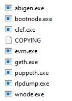

# HW18_Blockchain
Steps to set up and test Proof of Authority (POA) Blockchain

1. Download geth and tools from https://geth.etherium.org/downloads/ and choose version 1.9.7

2. Once download is finished, decompress files in your wroking directory (picture below)

    

3. Now using gitbash navigate into the working directory. we are going to create the nodes using the following codes

    ./geth account new --datadir node1

    ./geth account new --datadir node2

4. Save the address and private key seperately

5. Run puppeth, name the network puppernet, and select the option to configure a new genesis block. Follow the same steps as below.

    
    

- Chain/Network Id is set to 333
- Block time is set to the default 15 seconds.

6. With the genesis block creation completed, we will now initialize the nodes with the genesis' json file.

    Using geth, initialize each node with the new chrisbank.json using the following commands

    ./geth init chrisbank.json --datadir node1

    ./geth init chrisbank.json --datadir node2

    

7. Now the nodes can be used to begin mining blocks.

    Run the nodes in separate terminal windows with the commands:

    Node 1:
    
    ./geth --datadir node1 --unlock "0xF8d3277A00088746C18D109Df263Fa2221B7284b" --mine --rpc --allow-insecure-unlock

    Node 2:

    ./geth --datadir node2 --unlock "0x752aceb51D2b34DC6128C572136D88981f36292a" --mine --port 30304 --bootnodes "enode://28480104d9de566cf5fca149c3ea055f2ce8b499912464cb0ed20b36c32b02fb586829ececfec8511385c43cc410160e437bbecae0be0bcb9fda45aeb660c2e4@127.0.0.1:30303" --ipcdisable --allow-insecure-unlock

- The --rpc flag enables us to talk to our second node, which will allow us to use MyCrypto or Metamask to transact on our chain.

- Since the first node's sync port already took up 30303, we need to change this one to 30304 using --port.

- The --bootnodes flag allows you to pass the network info needed to find other nodes in the blockchain. This will allow us to connect both of our nodes.

    

8. After this step, you set up MyCrypto to send transaction however I faced a firewall problem that would not let the nodes connect unfortunately
